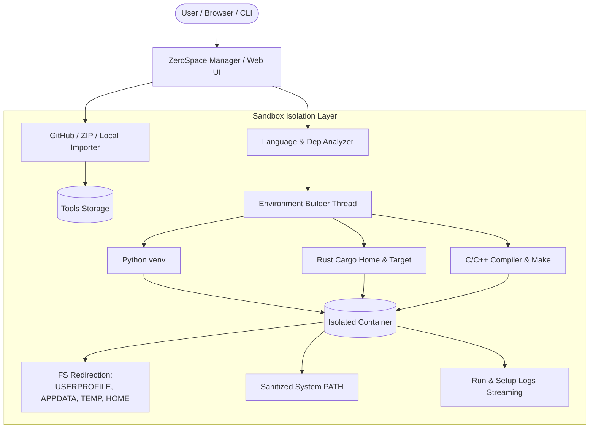

# ZEROSPACE 🛡️ // Cybersecurity Tool Manager & Sandbox

```text
  ███████╗███████╗██████╗  ██████╗ ███████╗██████╗  █████╗  ██████╗███████╗
  ╚══███╔╝██╔════╝██╔══██╗██╔═══██╗██╔════╝██╔══██╗██╔══██╗██╔════╝██╔════╝
    ███╔╝ █████╗  ██████╔╝██║   ██║███████╗██████╔╝███████║██║     █████╗  
   ███╔╝  ██╔══╝  ██╔══██╗██║   ██║╚════██║██╔═══╝ ██╔══██║██║     ██╔══╝  
  ███████╗███████╗██║  ██║╚██████╔╝███████║██║     ██║  ██║╚██████╗███████╗
  ╚══════╝╚══════╝╚═╝  ╚═╝ ╚═════╝ ╚══════╝╚═╝     ╚═╝  ╚═╝ ╚═════╝╚══════╝
                     [ CYBERSECURITY TOOL MANAGER & SANDBOX ]
```

[](#)
[](#)
[](#)
[](#)
[](#)

**ZeroSpace** is a security-focused tool manager and isolation platform designed for cybersecurity researchers, penetration testers, and developers. It downloads, automatically detects runtime environments, compiles, and runs potentially untrusted tools (from GitHub, direct URLs, or local folders) inside lightweight, multi-language sandbox containers.


---

## ⚡ Key Highlights

* **Automatic Language & Runtime Detection**: Automatically inspects source code for Python (`venv`), Rust (`cargo`), C/C++ (`gcc`, `g++`, `clang`, `Makefile`, `CMake`), and Multi-Language project combinations.
* **Rigorous Sandbox Isolation**:
  * **Filesystem Redirection**: All user profiles, temporary directories, and application data (`USERPROFILE`, `HOMEDRIVE`/`HOMEPATH`, `APPDATA`, `LOCALAPPDATA`, `TEMP`, `TMP`, and `HOME`) are strictly isolated inside the tool's container directory (`<container>/sandbox/`).
  * **Strict PATH Boundaries**: System `PATH` is sanitized to protect host utilities and personal folders while preserving required compilers and basic OS libraries.
* **Futuristic Cyberpunk UI**: Built-in red-and-black cyberpunk web interface with live streaming process logs, drawer inspection, status indicators, and an embedded container terminal/CLI runner.
* **Custom Container Storage**: Flexible path configuration allowing users to store containers, tools, and logs anywhere across drives.
* **Interactive CLI Runner**: Run package management or auxiliary commands (`pip install`, custom commands) directly inside any tool's sandbox environment.
* **Ready-to-Deploy Standalone Bundles**: Zero-dependency Windows standalone binary (`.exe`) and Linux Debian (`.deb`) package generation scripts.

---

## 🏗️ Architecture & Isolation Model



---

## 🚀 Quick Start

### 1. Requirements

* **Python 3.8+**
* *(Optional for C/C++)*: `gcc`, `g++`, `clang`, `mingw32-make`, or `make`
* *(Optional for Rust)*: `cargo` / `rustc`

### 2. Installation & Running from Source

```bash
# Clone or navigate to the repository
git clone https://github.com/your-username/ZeroSpace.git
cd ZeroSpace

# Install dependencies
pip install -r requirements.txt
# (or Flask if running minimal setup: pip install flask)

# Launch the Web Dashboard
python main.py
```
ZeroSpace will automatically boot the server and open your default browser to `http://127.0.0.1:5000`.

### 3. Run from .exe and deb file

```bash
# Navigate to /dist directory

# For Windows
Double click on Zerospace.exe


# For Linux
dpkg -i zerospace.deb
zerospace
```
---

## 🖥️ Command Line Interface (CLI)

ZeroSpace includes a full-featured CLI for headless systems or automation workflows:

```bash
# Start the Web UI Server
python main.py

# List all registered tools and their statuses
python main.py list

# Run a sandboxed command inside a specific tool's container
python main.py cli <tool_id> <command>

# Example: Run pip install inside a Python tool's virtual environment
python main.py cli my_tool_178815 "pip install colorama"

# Display CLI Help
python main.py --help
```

---

## 🌐 Web Dashboard Overview

The ZeroSpace web interface provides a streamlined control center:

| View | Description |
| :--- | :--- |
| **Installed Tools** | Interactive Cyberpunk grid with search filter, language badges, and status pulses. |
| **Tool Drawer** | Real-time console logs, execution arguments input, Run/Stop/Restart/Update controls, and interactive sandbox CLI. |
| **Add Tool** | One-click tool installer from GitHub repo links, ZIP URLs, or local directory paths with optional runtime & container path overrides. |
| **Containers** | Storage isolation report detailing on-disk footprint (MB) and sandbox status. |
| **Global Logs** | Centralized console viewer for execution logs (`run`) and compilation logs (`setup`). |
| **Settings** | Dynamic path configuration for tools, containers, and logs directories with one-click database reset. |

---

## 📦 Building Standalone Packages

ZeroSpace comes with turnkey packaging scripts:

### Windows Standalone Executable (.exe)
```bash
python build_exe.py
# Output generated at: dist/zerospace.exe
```

### Linux Debian Package (.deb)
```bash
python build_deb.py
# Output generated at: dist/zerospace.deb
```

---

## 🧪 Testing & Verification

ZeroSpace includes automated test suites to verify filesystem sandboxing and compiler toolchains:

```bash
# Run filesystem isolation & path redirection tests
python tests/integration_test.py

# Run multi-language (C, Rust, Python+C) compilation & execution tests
python tests/multi_language_test.py
```

---

## ⚙️ Configuration & Paths

By default, ZeroSpace maintains tool data in your user directory:

* **Default Base Path**: `~/.zerospace/`
* **Database**: `~/.zerospace/database.json`
* **Source Code**: `~/.zerospace/tools/`
* **Sandboxes**: `~/.zerospace/containers/`
* **Logs**: `~/.zerospace/logs/`

> All directories can be dynamically reconfigured at runtime via the **Settings** tab in the Web UI or through the `/api/settings` REST endpoint.

---

## 🛡️ Sandbox Redirections Reference

| Environment Variable | Redirected Target |
| :--- | :--- |
| `USERPROFILE` | `<container_path>/sandbox/home` |
| `HOMEDRIVE` / `HOMEPATH` | Dynamic drive and folder split pointing to `<container_path>/sandbox/home` |
| `APPDATA` | `<container_path>/sandbox/appdata` |
| `LOCALAPPDATA` | `<container_path>/sandbox/appdata/Local` |
| `TEMP` / `TMP` | `<container_path>/sandbox/temp` |
| `HOME` *(Unix)* | `<container_path>/sandbox/home` |
| `PATH` | Restricts system access while preserving toolchain binaries (`gcc`, `cargo`, venv `Scripts`) |

---

## 🤝 Contributing

Contributions, issues, and feature requests are welcome!
1. Fork the repository
2. Create your feature branch (`git checkout -b feature/awesome-feature`)
3. Commit your changes (`git commit -m 'Add awesome feature'`)
4. Push to the branch (`git push origin feature/awesome-feature`)
5. Open a Pull Request

---

## 📜 License

Distributed under the MIT License. See `LICENSE` for more information.
